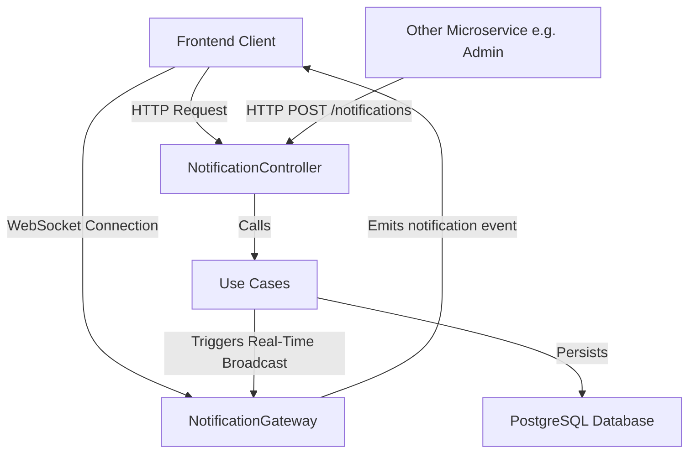

# VariaMos Notifications Microservice

NestJS microservice to store and dispatch notifications in real-time (REST + WebSockets) for the VariaMos platform.

---

## Overview



---

## Configuration

Set these variables in your local `.env` file:

```env
PORT=3000
DATABASE_HOST=localhost
DATABASE_PORT=5432
DATABASE_USERNAME=variamos_user
DATABASE_PASSWORD=variamos_password
DATABASE_NAME=variamos_notifications
DATABASE_SSL=false
NOTIFICATION_INTERNAL_TOKEN=your-shared-secret-token
```

---

## HTTP REST API

All routes are prefixed with `/notifications`.

### 1. Send a notification (internal call)
*   **POST** `/`
*   **Headers:** `x-internal-token: <NOTIFICATION_INTERNAL_TOKEN>`
*   **Body (JSON):**
    ```json
    {
      "recipients": {
        "userIds": ["user-uuid-1"],
        "roles": ["administrator"]
      },
      "templateKey": "review_assigned",
      "variables": { "languageName": "French" },
      "metadata": { "tag": "linguistics" },
      "actorId": "user-uuid-actor"
    }
    ```
*   **Recipient Targeting Logic:**
    *   **Specific Users:** Pass an array of user UUIDs in `recipients.userIds`.
    *   **By Role:** Pass an array of role names in `recipients.roles` (the service will fetch and resolve all user IDs belonging to these roles).
    *   **Deduplication:** You can mix both `userIds` and `roles`. The service automatically deduplicates recipients to ensure no user receives the same notification twice.
    *   **Broadcast:** To broadcast to all users, target the general system role that includes all registered users (e.g. `member` or `user`).
*   **Response:** `201 Created`

### Get notifications
*   **GET** `/`
*   **Query params:**
    *   `recipientId` (required): User UUID
    *   `folder` (optional): `"inbox"` (default) or `"trash"`
    *   `page` (optional): default `1`
    *   `limit` (optional): default `10`

### Mark a notification as read
*   **PATCH** `/:id/read`
*   **Response:** `200 OK`

### Mark all as read
*   **PATCH** `/read-all?recipientId=<user-uuid>`
*   **Response:** `204 No Content`

### Empty trash
*   **DELETE** `/trash?recipientId=<user-uuid>`
*   **Response:** `204 No Content`

### Get preferences
*   **GET** `/preferences?recipientId=<user-uuid>`

### Update preferences
*   **PATCH** `/preferences?recipientId=<user-uuid>`
*   **Body (JSON):**
    ```json
    {
      "emailEnabled": true,
      "inAppEnabled": false,
      "mutedEventTypes": ["project_created"]
    }
    ```

---

## WebSockets

Clients connect using Socket.io to receive real-time notifications.

*   **URL:** `ws://localhost:3000`
*   **Handshake:** Pass the `userId` in the handshake (auth or query params):
    ```javascript
    import { io } from "socket.io-client";
    const socket = io("http://localhost:3000", {
      query: { userId: "user-uuid-1" }
    });
    ```
*   **Event:** Listen to the `"notification"` event:
    ```javascript
    socket.on("notification", (data) => {
      console.log("Received notification:", data);
    });
    ```

---

## Client Microservice Integration

Add these variables to your microservice's `.env` configuration:
```env
NOTIFICATION_SERVICE_URL=http://localhost:3000
NOTIFICATION_INTERNAL_TOKEN=your-shared-secret-token
```

### TypeScript client snippet:
```typescript
import axios from "axios";

export class NotificationClient {
  private readonly url = process.env.NOTIFICATION_SERVICE_URL;
  private readonly token = process.env.NOTIFICATION_INTERNAL_TOKEN;

  public async sendNotification(payload: {
    recipients: { userIds?: string[]; roles?: string[] };
    templateKey: string;
    variables?: Record<string, any>;
    metadata?: Record<string, any>;
    actorId?: string | null;
  }): Promise<void> {
    if (!this.url || !this.token) return;

    await axios.post(`${this.url}/notifications`, payload, {
      headers: {
        "x-internal-token": this.token,
        "Content-Type": "application/json",
      },
    });
  }
}
```

---

## Local Development

### 1. Database
Configure your database credentials in `.env`.
*Hint: Run Postgres in Docker with the default credentials matching the .env above:*

```bash
docker run --name variamos-postgres -e POSTGRES_USER=variamos_user -e POSTGRES_PASSWORD=variamos_password -e POSTGRES_DB=variamos_notifications -p 5432:5432 -d postgres
```

### 2. Run the app
```bash
npm install
npm run start:dev
```

### 3. Tests
```bash
npm run test      # Unit tests
npm run test:e2e  # Integration & E2E (uses Docker Testcontainers)
npm run lint      # Biome formatting
```
